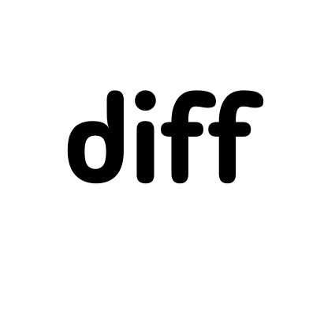

# diffagent

[](https://www.npmjs.com/package/diffagent)

Diffagent is an agent-agnostic, GitHub-style diff viewer and code review tool.

```bash
npm install -g diffagent
```

It works with Claude Code, Cursor, Codex, and any AI coding agent.

| What can you do? | Description |
|---|---|
| [See your diffs](#see-your-diffs) | View changes in working area, across commits, branches, tags, etc  |
| [AI code review](#ai-code-review) | Let your agent review code and leave comments on the diff |
| [Browse project files](#browse-project-files) | Explore your repo and comment on any file for AI to resolve |
| [Guided code tours](#guided-code-tours) | Walk through your codebase step by step with highlighted code |
| [Learn any topic](#learn-any-topic) | Project-driven learning for programming languages, tools, and frameworks |
| [GitHub PRs](#github-prs) | Pull down a PR, review it locally, push comments back to GitHub |
| [Multiple projects](#multiple-projects) | Run it in multiple repos at once, each gets its own port |

## See your diffs

Run `diffagent` inside any git repo — your browser opens with a GitHub-style, syntax-highlighted diff.

```bash
# everyday use
diffagent                                    # review all uncommitted changes
diffagent HEAD~1                             # review your last commit
diffagent HEAD~3                             # review your last 3 commits

# branch workflows
diffagent main                               # compare current branch against main
diffagent main..feature                      # compare feature branch against main
diffagent main feature                       # same as above, shorthand syntax
diffagent --base main --compare feature      # same as above, explicit flags

# releases and tags
diffagent v1.0.0 v2.0.0                     # compare two releases
diffagent v1.0.0                             # what changed since v1.0.0

# specific commits
diffagent abc1234                            # changes since a specific commit
diffagent abc1234..def5678                   # changes between two commits

# filter by change type
diffagent work                               # all changes (staged + unstaged + untracked)
diffagent staged                             # only staged changes (git add'd)
diffagent unstaged                           # only unstaged modifications
```

The `--base`/`--compare` flags use the same terminology as GitHub PRs — base is what you're comparing against, compare is the branch with changes. You can also use range syntax (`main..feature`) or just pass two positional args (`diffagent main feature`).

You can leave comments on any diff — working tree changes, branch comparisons, commit ranges. Your agent can also review and leave its own comments. Either way, run `/diffagent-resolve` and your agent reads all open comments (yours or its own) and makes the code changes for you.

## AI code review

Install the skills for your coding agent (Claude Code, Cursor, Codex, etc.):

```bash
npx skills add kamranahmedse/diffagent
```

Then use the slash commands:

### `/diffagent-diff`

Opens the diff viewer in your browser. Accepts the same refs as the CLI, plus natural language:

```
/diffagent-diff                          # working tree changes
/diffagent-diff main                     # current branch against main
/diffagent-diff main..feature            # branch diff
/diffagent-diff HEAD~1                   # last commit
/diffagent-diff last 3 commits           # natural language works too
```

Leave comments on any line — when you're done, run `/diffagent-resolve` to have your agent fix them.

### `/diffagent-review`

Your agent reviews the diff and leaves inline comments in the viewer. Uses severity tags (`[must-fix]`, `[suggestion]`, `[nit]`, `[question]`) so you can triage by importance. Supports refs, focus areas, and natural language:

```
/diffagent-review                             # review working tree changes
/diffagent-review main                        # review what you're merging into main
/diffagent-review main..feature               # review what you're merging into main
/diffagent-review identify security issues    # focus on security issues
/diffagent-review performance in src/lib      # focus on performance in specific dir
/diffagent-review last 3 commits              # natural language works too
```

### `/diffagent-resolve`

Reads all open comments and makes the requested code changes. Works with both your comments and AI review comments:

```
/diffagent-resolve                       # resolve all open comments
/diffagent-resolve abc123                # resolve a specific thread by ID
```

A typical workflow: run `/diffagent-review` to get AI feedback, check the comments in the browser, then run `/diffagent-resolve` to apply the fixes.

## Browse project files

Run `diffagent tree` to open a full file tree browser — no diff required. Browse your repo, read files with syntax highlighting, and leave comments on any file or folder.

```bash
diffagent tree
```

The tree view supports the same commenting and resolve workflow as the diff viewer. Leave comments on specific lines, files, or folders, then have your agent resolve them.

### `/diffagent-tree`

Opens the file tree browser:

```
/diffagent-tree
```

### `/diffagent-resolve-tree`

Reads open comments from the tree browser and makes the requested code changes:

```
/diffagent-resolve-tree                  # resolve all open comments
/diffagent-resolve-tree abc123           # resolve a specific thread by ID
```

## Guided code tours

Create narrated, step-by-step walkthroughs of your codebase. Tours open in the browser with a sidebar showing the narrative and highlighted code sections.

### `/diffagent-tour`

Your agent researches the codebase, then builds a tour with highlighted code regions and rich markdown explanations:

```
/diffagent-tour how does authentication work?
/diffagent-tour explain the request lifecycle
/diffagent-tour how are comments stored and retrieved?
/diffagent-tour closures
/diffagent-tour async/await patterns
```

Works for both features ("how does auth work?") and concepts ("closures", "generics"). For concepts, the agent finds real examples in your codebase and teaches the concept progressively from simple to complex.

Each tour has an intro (step 0) with an architectural overview, followed by numbered steps that highlight specific code regions and explain them in detail. The agent follows the actual execution path, not file order.

Tour steps can include **sub-highlights** — clickable focus links in the narrative that narrow the highlight to a specific sub-range within the step. Useful for walking through large functions section by section.

## Learn any topic

Start a project-driven learning journey for any programming language, tool, or framework. Your agent becomes a tutor — it builds teaching projects that open as guided tours in the browser, gives you challenges to complete, reviews your code with inline feedback, and adapts to your pace.

### `/diffagent-learn`

Kick off a learning journey. Run it in an empty directory where you want to keep your learning files — the agent creates a `learn-<topic>/` folder with lessons, projects, and progress tracking.

```bash
mkdir ~/learning && cd ~/learning
```

Then start learning:

```
/diffagent-learn Rust
/diffagent-learn Go
/diffagent-learn Docker
/diffagent-learn SQL
/diffagent-learn TypeScript
/diffagent-learn Kubernetes
```

Each lesson follows a loop: your agent builds a small project and opens it as a Diffagent tour explaining the concepts, then gives you a challenge to build yourself. When you're done, it reviews your code with inline Diffagent comments and decides what to teach next.

Progress is saved to `learn.json` — come back anytime and pick up where you left off. The agent tracks what you've mastered, what you're struggling with, and adjusts the curriculum accordingly.

## GitHub PRs

Pass a GitHub PR URL to view and review pull requests locally:

```bash
diffagent https://github.com/owner/repo/pull/123
```

This checks out the PR, opens the diff against its base branch, and lets you leave comments in the viewer. Requires the [`gh` CLI](https://cli.github.com/) installed and authenticated (`gh auth login`), and the current repo must match the PR's repository.

You can push your comments (including AI review comments) back to GitHub as PR review comments, and pull existing GitHub comments into the viewer. Both are available from the viewer UI.

The skills work with PR URLs too:

```
/diffagent-diff https://github.com/owner/repo/pull/123
/diffagent-review https://github.com/owner/repo/pull/123
```

## Multiple projects

Diffagent supports running multiple projects simultaneously. Each gets its own port automatically:

```bash
# Terminal 1 — starts on :5391
cd ~/projects/app && diffagent

# Terminal 2 — starts on :5392
cd ~/projects/api && diffagent
```

If you run `diffagent` in a repo that already has a running instance, it opens the existing one instead of starting a new server. Use `--new` to kill the existing instance and start fresh.

```bash
diffagent list               # show all running instances
diffagent list --json        # machine-readable output
```

## Options

```
--base <ref>       Base ref to compare from (e.g. main, HEAD~3, v1.0.0)
--compare <ref>    Ref to compare against base (default: working tree)
--port <port>      Custom port (default: auto-assigned from 5391)
--no-open          Don't open browser
--dark             Dark mode
--unified          Unified view (default: split)
--quiet            Minimal terminal output
--new              Stop existing instance and start fresh
```

## License

[PolyForm Shield 1.0.0](./LICENSE) © [Kamran Ahmed](https://x.com/kamrify)
